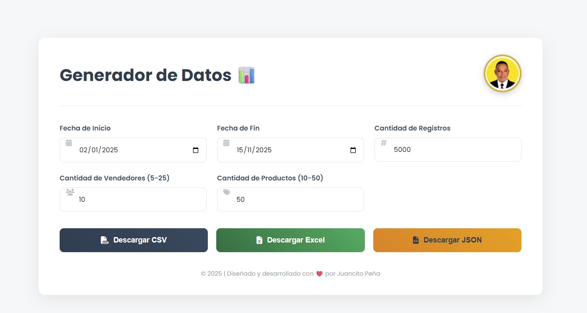

# Generador de Datos de Ventas para Tiendas de Lujo

Este es un mini-proyecto web que consiste en una herramienta avanzada para generar datos sintéticos (mock data) de ventas, simulando las operaciones de una tienda de moda de lujo en la República Dominicana. La interfaz, creada con **HTML, CSS y JavaScript puro**, es moderna, intuitiva y permite al usuario personalizar y descargar los datos en múltiples formatos.

## ✨ Características Principales

- **Interfaz Moderna y Atractiva**: Diseño limpio y profesional con una excelente experiencia de usuario (UI/UX), utilizando una paleta de colores sofisticada e iconos descriptivos.  
- **Generación de Datos Personalizable**: Permite configurar los siguientes parámetros:  
  - Rango de Fechas (Fecha de Inicio y Fin).  
  - Cantidad de Registros a generar.  
  - Número de Vendedores.  
  - Número de Productos.  
- **Datos Realistas**: El script utiliza nombres reales de productos de marcas de lujo (Louis Vuitton, Gucci, Prada, etc.) para darle más realismo a los datos generados.  
- **Múltiples Formatos de Exportación**: Con un solo clic, el usuario puede descargar los datos generados en tres formatos populares:  
  - **CSV**: Ideal para hojas de cálculo y análisis de datos simple.  
  - **Excel (.xlsx)**: Archivo nativo de Excel, generado gracias a la librería SheetJS.  
  - **JSON**: Perfecto para ser consumido por otras aplicaciones y APIs.  
- **Modal Interactivo del Autor**: Al hacer clic en la imagen de perfil, se abre una elegante ventana modal con información del desarrollador (Juancito Peña), incluyendo una breve biografía, servicios y enlaces a redes sociales.  
- **Valores por Defecto Inteligentes**: El formulario se carga con valores predefinidos (fechas, cantidades) para permitir una generación de datos rápida y sin configuración manual.  
- **Cero Dependencias (Frontend)**: Construido exclusivamente con HTML, CSS y JavaScript vainilla, sin necesidad de frameworks, lo que lo hace extremadamente ligero y rápido.  

---

## 🚀 Tecnologías Utilizadas

- **HTML5**: Para la estructura semántica del contenido.  
- **CSS3**: Para el diseño y la estilización avanzada.  
- **Flexbox y Grid Layout**: Para crear una maquetación moderna y responsive.  
- **Animaciones y Transiciones**: Para efectos visuales como el "latido" de la imagen de perfil y las interacciones con los botones.  
- **JavaScript (ES6+)**: Para toda la lógica de la aplicación:  
  - Manipulación del DOM.  
  - Generación de datos aleatorios.  
  - Creación y descarga dinámica de archivos.  
- **Librerías Externas**:  
  - **SheetJS (xlsx.js)**: Para la potente funcionalidad de exportación a formato Excel (.xlsx).  
  - **Font Awesome**: Para los iconos utilizados en la interfaz.  
  - **Google Fonts**: Para la tipografía Poppins.  

---

## 🛠️ ¿Cómo Utilizarlo?

Es muy sencillo. No se requiere instalación ni configuración de un servidor.

1. Clona o descarga este repositorio.  
2. Abre el archivo `index.html` directamente en tu navegador web preferido (Google Chrome, Firefox, Edge, etc.).  
3. Ajusta los parámetros en el formulario a tu gusto o utiliza los valores por defecto.  
4. Haz clic en el botón del formato en el que deseas descargar los datos (**CSV, Excel o JSON**).  
5. ¡Listo! El archivo se descargará automáticamente en tu carpeta de descargas.  

---

## 👤 Autor

Este proyecto fue diseñado y desarrollado por:  
**Juancito Peña**  

- GitHub: [@tu-usuario-de-github]  
- LinkedIn: [@tu-usuario-de-linkedin]  
- Twitter: [@tu-usuario-de-twitter]  

---

## 📄 Licencia

Este proyecto está bajo la **Licencia MIT**. Consulta el archivo LICENSE para más detalles.
